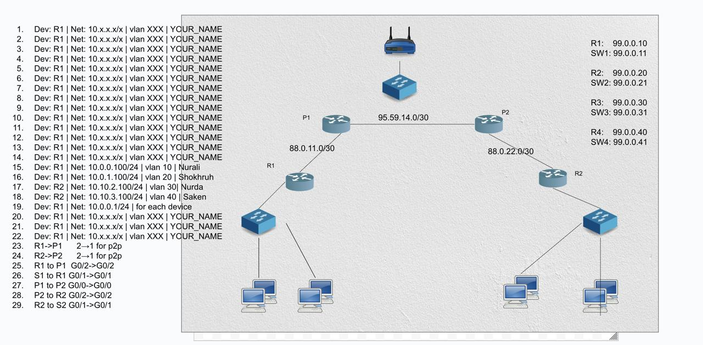

# NAT Configuration

## Network Topology

## Configuration Files

- **Routers**: Configuration files for routers
- **Switches**: Configuration files for switches  
- **End Devices**: Configuration files for end devices (PC1, PC2, PC3, PC4)
